# GutShoes — Entity Relationship Diagram & Database Design

**Document Version:** 1.0  
**Source:** GutShoes PRD v1.0  
**Status:** ERD Baseline  
**Architecture:** Relational Database  
**Recommended Database:** MySQL 8 / InnoDB  
**Backend:** Laravel  
**Frontend:** React JS

---

# 1. Database Design Goals

Database GutShoes dirancang dengan beberapa prinsip utama:

1. Transactional integrity.
2. Strong referential integrity.
3. Historical transaction immutability.
4. Prevention of inventory overselling.
5. Payment webhook idempotency.
6. Auditability.
7. Extensible product/catalog architecture.
8. Clear separation between master data and transactional data.
9. Avoid unnecessary polymorphic relationships for critical commerce data.
10. Keep the MVP implementation manageable without sacrificing future scalability.

---

# 2. Primary Key Strategy

Semua tabel utama menggunakan:

```text
BIGINT UNSIGNED AUTO_INCREMENT
```

Contoh:

```text
id BIGINT UNSIGNED PRIMARY KEY
```

Public-facing identifiers tidak menggunakan primary key database.

Contoh:

```text
orders.id
1
2
3
4
```

Customer melihat:

```text
GS-20260820-00001
```

bukan:

```text
order #4
```

Dengan demikian internal database ID tidak terekspos dan public identifier dapat berubah format tanpa mempengaruhi relationships.

---

# 3. Monetary Data

Semua monetary field menggunakan:

```text
DECIMAL(15,2)
```

Contoh:

```text
price DECIMAL(15,2)
grand_total DECIMAL(15,2)
shipping_fee DECIMAL(15,2)
```

Jangan menggunakan:

```text
FLOAT
DOUBLE
```

untuk nilai finansial.

Currency MVP:

```text
IDR
```

Tetap simpan:

```text
currency CHAR(3)
```

pada transaksi agar schema tetap future-proof.

---

# 4. Timestamp Convention

Default transactional tables menggunakan:

```text
created_at
updated_at
```

Business event menggunakan timestamp spesifik.

Contoh:

```text
paid_at
expires_at
published_at
shipped_at
delivered_at
cancelled_at
processed_at
```

Jangan menggunakan `updated_at` untuk menentukan kapan sebuah business event terjadi.

---

# 5. Status Strategy

Status disimpan menggunakan string dengan domain yang terkontrol.

Contoh:

```text
orders.status

PENDING_PAYMENT
PAID
PROCESSING
SHIPPED
DELIVERED
CANCELLED
```

Laravel dapat menggunakan PHP Backed Enum sebagai representation layer.

Database dapat menambahkan `CHECK` constraint untuk status yang stabil.

Pendekatan ini dipilih agar schema lebih mudah dikembangkan dibanding menjadikan setiap status sebagai reference table.

---

# 6. Soft Delete Strategy

Soft delete digunakan untuk master data yang kemungkinan pernah direferensikan transaksi.

Recommended:

```text
users
brands
categories
products
product_variants
```

Menggunakan:

```text
deleted_at DATETIME NULL
```

Tidak semua tabel membutuhkan soft delete.

Transactional history seperti:

```text
orders
order_items
payments
refunds
inventory_movements
```

tidak boleh dihapus melalui operasi aplikasi normal.

---

# 7. High-Level Domain Model

```text
IDENTITY
├── users
└── customer_addresses

CATALOG
├── brands
├── categories
├── products
├── product_categories
├── product_images
└── product_variants

INVENTORY
├── inventories
├── inventory_reservations
└── inventory_movements

CART
├── carts
└── cart_items

ORDER
├── orders
├── order_addresses
├── order_items
├── order_status_histories
└── order_cancellations

PAYMENT
├── payments
├── payment_webhook_logs
└── refunds

SHIPPING
├── warehouses
├── shipping_providers
└── shipments

PROMOTION
├── discounts
├── discount_products
├── discount_categories
├── discount_brands
├── vouchers
├── voucher_products
└── voucher_redemptions

ADMINISTRATION
├── store_settings
├── audit_logs
└── notification_logs
```

---

# 8. Core ERD

```mermaid
erDiagram

    USERS {
        bigint id PK
        varchar user_type
        varchar name
        varchar email UK
        varchar phone
        varchar google_id UK
        varchar avatar_url
        varchar password_hash
        datetime email_verified_at
        datetime created_at
        datetime updated_at
        datetime deleted_at
    }

    CUSTOMER_ADDRESSES {
        bigint id PK
        bigint user_id FK
        varchar label
        varchar recipient_name
        varchar phone
        varchar province_code
        varchar province_name
        varchar city_code
        varchar city_name
        varchar district_code
        varchar district_name
        varchar postal_code
        text address_line
        boolean is_default
        datetime created_at
        datetime updated_at
    }

    BRANDS {
        bigint id PK
        varchar name
        varchar slug UK
        varchar logo_url
        datetime created_at
        datetime updated_at
        datetime deleted_at
    }

    CATEGORIES {
        bigint id PK
        bigint parent_id FK
        varchar name
        varchar slug UK
        datetime created_at
        datetime updated_at
        datetime deleted_at
    }

    PRODUCTS {
        bigint id PK
        bigint brand_id FK
        varchar name
        varchar slug UK
        text description
        varchar status
        datetime published_at
        datetime created_at
        datetime updated_at
        datetime deleted_at
    }

    PRODUCT_CATEGORIES {
        bigint product_id PK,FK
        bigint category_id PK,FK
    }

    PRODUCT_IMAGES {
        bigint id PK
        bigint product_id FK
        varchar image_url
        tinyint sort_order
        datetime created_at
    }

    PRODUCT_VARIANTS {
        bigint id PK
        bigint product_id FK
        varchar sku UK
        varchar size_label
        decimal price
        int weight_grams
        smallint sort_order
        datetime created_at
        datetime updated_at
        datetime deleted_at
    }

    INVENTORIES {
        bigint id PK
        bigint product_variant_id FK,UK
        int on_hand_quantity
        int reserved_quantity
        datetime created_at
        datetime updated_at
    }

    CARTS {
        bigint id PK
        bigint user_id FK
        varchar guest_token UK
        datetime converted_at
        datetime created_at
        datetime updated_at
    }

    CART_ITEMS {
        bigint id PK
        bigint cart_id FK
        bigint product_variant_id FK
        int quantity
        datetime created_at
        datetime updated_at
    }

    ORDERS {
        bigint id PK
        bigint user_id FK
        bigint voucher_id FK
        varchar order_number UK
        varchar status
        varchar customer_name
        varchar customer_email
        varchar customer_phone
        char currency
        decimal subtotal
        decimal product_discount_total
        decimal voucher_discount_total
        decimal shipping_fee
        decimal shipping_discount_total
        decimal grand_total
        datetime payment_expires_at
        datetime placed_at
        datetime cancelled_at
        datetime created_at
        datetime updated_at
    }

    ORDER_ADDRESSES {
        bigint id PK
        bigint order_id FK,UK
        varchar recipient_name
        varchar phone
        varchar province_code
        varchar province_name
        varchar city_code
        varchar city_name
        varchar district_code
        varchar district_name
        varchar postal_code
        text address_line
    }

    ORDER_ITEMS {
        bigint id PK
        bigint order_id FK
        bigint product_id FK
        bigint product_variant_id FK
        bigint applied_discount_id FK
        varchar product_name
        varchar brand_name
        varchar sku
        varchar size_label
        decimal unit_price
        decimal discount_amount
        decimal final_unit_price
        int quantity
        int unit_weight_grams
        decimal line_subtotal
        decimal line_discount_total
        decimal line_total
        datetime created_at
    }

    INVENTORY_RESERVATIONS {
        bigint id PK
        bigint order_id FK
        bigint order_item_id FK,UK
        bigint product_variant_id FK
        int quantity
        varchar status
        datetime expires_at
        datetime confirmed_at
        datetime released_at
        datetime created_at
        datetime updated_at
    }

    INVENTORY_MOVEMENTS {
        bigint id PK
        bigint product_variant_id FK
        bigint inventory_reservation_id FK
        bigint order_item_id FK
        bigint actor_user_id FK
        varchar movement_type
        int on_hand_delta
        int reserved_delta
        int on_hand_after
        int reserved_after
        varchar note
        datetime created_at
    }

    ORDER_STATUS_HISTORIES {
        bigint id PK
        bigint order_id FK
        bigint changed_by_user_id FK
        varchar from_status
        varchar to_status
        varchar note
        datetime created_at
    }

    ORDER_CANCELLATIONS {
        bigint id PK
        bigint order_id FK,UK
        bigint requested_by_user_id FK
        bigint reviewed_by_user_id FK
        varchar status
        text reason
        datetime requested_at
        datetime reviewed_at
        datetime created_at
        datetime updated_at
    }

    PAYMENTS {
        bigint id PK
        bigint order_id FK
        varchar provider
        varchar provider_order_id UK
        varchar provider_transaction_id UK
        varchar payment_method
        varchar status
        decimal amount
        char currency
        datetime expires_at
        datetime paid_at
        json provider_metadata
        datetime created_at
        datetime updated_at
    }

    PAYMENT_WEBHOOK_LOGS {
        bigint id PK
        bigint payment_id FK
        varchar provider
        varchar provider_transaction_id
        varchar event_key
        varchar transaction_status
        varchar processing_status
        json payload
        text error_message
        datetime received_at
        datetime processed_at
    }

    REFUNDS {
        bigint id PK
        bigint order_id FK
        bigint payment_id FK
        bigint requested_by_user_id FK
        bigint reviewed_by_user_id FK
        varchar provider_refund_id UK
        decimal amount
        varchar status
        text reason
        datetime requested_at
        datetime processed_at
        datetime created_at
        datetime updated_at
    }

    WAREHOUSES {
        bigint id PK
        varchar name
        varchar phone
        varchar province_code
        varchar province_name
        varchar city_code
        varchar city_name
        varchar district_code
        varchar district_name
        varchar postal_code
        text address_line
        datetime created_at
        datetime updated_at
    }

    SHIPPING_PROVIDERS {
        bigint id PK
        varchar code UK
        varchar name
        boolean enabled
        datetime created_at
        datetime updated_at
    }

    SHIPMENTS {
        bigint id PK
        bigint order_id FK,UK
        bigint warehouse_id FK
        bigint shipping_provider_id FK
        varchar provider_code
        varchar courier_code
        varchar courier_name
        varchar service_code
        varchar service_name
        varchar tracking_number
        decimal shipping_fee
        int total_weight_grams
        varchar status
        datetime shipped_at
        datetime delivered_at
        datetime created_at
        datetime updated_at
    }

    DISCOUNTS {
        bigint id PK
        varchar name
        varchar scope
        varchar discount_type
        decimal value
        decimal max_discount_amount
        int priority
        datetime starts_at
        datetime ends_at
        datetime created_at
        datetime updated_at
    }

    DISCOUNT_PRODUCTS {
        bigint discount_id PK,FK
        bigint product_id PK,FK
    }

    DISCOUNT_CATEGORIES {
        bigint discount_id PK,FK
        bigint category_id PK,FK
    }

    DISCOUNT_BRANDS {
        bigint discount_id PK,FK
        bigint brand_id PK,FK
    }

    VOUCHERS {
        bigint id PK
        varchar code UK
        varchar name
        varchar type
        decimal value
        decimal minimum_order_amount
        decimal max_discount_amount
        int global_usage_limit
        datetime starts_at
        datetime ends_at
        datetime created_at
        datetime updated_at
    }

    VOUCHER_PRODUCTS {
        bigint voucher_id PK,FK
        bigint product_id PK,FK
    }

    VOUCHER_REDEMPTIONS {
        bigint id PK
        bigint voucher_id FK
        bigint order_id FK,UK
        bigint user_id FK
        varchar customer_email
        varchar status
        decimal discount_amount
        datetime reserved_at
        datetime consumed_at
        datetime released_at
    }

    STORE_SETTINGS {
        bigint id PK
        bigint default_warehouse_id FK
        varchar store_name
        varchar store_email
        varchar store_phone
        varchar store_logo_url
        int low_stock_threshold
        datetime created_at
        datetime updated_at
    }

    AUDIT_LOGS {
        bigint id PK
        bigint actor_user_id FK
        varchar action
        varchar entity_type
        bigint entity_id
        text description
        json old_values
        json new_values
        varchar ip_address
        varchar user_agent
        datetime created_at
    }

    NOTIFICATION_LOGS {
        bigint id PK
        bigint order_id FK
        bigint user_id FK
        varchar recipient_email
        varchar notification_type
        varchar status
        varchar provider_message_id
        int attempts
        text error_message
        datetime sent_at
        datetime created_at
        datetime updated_at
    }

    USERS ||--o{ CUSTOMER_ADDRESSES : has

    BRANDS ||--o{ PRODUCTS : owns
    CATEGORIES ||--o{ CATEGORIES : parent
    PRODUCTS ||--o{ PRODUCT_CATEGORIES : categorized
    CATEGORIES ||--o{ PRODUCT_CATEGORIES : contains
    PRODUCTS ||--o{ PRODUCT_IMAGES : has
    PRODUCTS ||--o{ PRODUCT_VARIANTS : has

    PRODUCT_VARIANTS ||--|| INVENTORIES : inventory

    USERS ||--o{ CARTS : owns
    CARTS ||--o{ CART_ITEMS : contains
    PRODUCT_VARIANTS ||--o{ CART_ITEMS : selected

    USERS ||--o{ ORDERS : places
    ORDERS ||--|| ORDER_ADDRESSES : ships_to
    ORDERS ||--o{ ORDER_ITEMS : contains
    PRODUCTS ||--o{ ORDER_ITEMS : references
    PRODUCT_VARIANTS ||--o{ ORDER_ITEMS : references

    ORDERS ||--o{ ORDER_STATUS_HISTORIES : history
    ORDERS ||--o| ORDER_CANCELLATIONS : cancellation

    ORDERS ||--o{ INVENTORY_RESERVATIONS : reserves
    ORDER_ITEMS ||--o| INVENTORY_RESERVATIONS : reserves
    PRODUCT_VARIANTS ||--o{ INVENTORY_RESERVATIONS : reserved_variant

    PRODUCT_VARIANTS ||--o{ INVENTORY_MOVEMENTS : movements
    INVENTORY_RESERVATIONS ||--o{ INVENTORY_MOVEMENTS : produces

    ORDERS ||--o{ PAYMENTS : payments
    PAYMENTS ||--o{ PAYMENT_WEBHOOK_LOGS : notifications

    ORDERS ||--o{ REFUNDS : refunds
    PAYMENTS ||--o{ REFUNDS : refunded_from

    WAREHOUSES ||--o{ SHIPMENTS : origin
    SHIPPING_PROVIDERS ||--o{ SHIPMENTS : handles
    ORDERS ||--o| SHIPMENTS : shipment

    DISCOUNTS ||--o{ DISCOUNT_PRODUCTS : targets
    PRODUCTS ||--o{ DISCOUNT_PRODUCTS : targeted

    DISCOUNTS ||--o{ DISCOUNT_CATEGORIES : targets
    CATEGORIES ||--o{ DISCOUNT_CATEGORIES : targeted

    DISCOUNTS ||--o{ DISCOUNT_BRANDS : targets
    BRANDS ||--o{ DISCOUNT_BRANDS : targeted

    VOUCHERS ||--o{ VOUCHER_PRODUCTS : targets
    PRODUCTS ||--o{ VOUCHER_PRODUCTS : eligible

    VOUCHERS ||--o{ VOUCHER_REDEMPTIONS : redeemed
    ORDERS ||--o| VOUCHER_REDEMPTIONS : redemption

    WAREHOUSES ||--o| STORE_SETTINGS : default_origin

    USERS ||--o{ AUDIT_LOGS : performs
```



---

# 9. Identity Domain

## 9.1 `users`

Digunakan untuk authenticated customer dan admin.

| Column | Type | Constraint |
|---|---|---|
| id | BIGINT UNSIGNED | PK |
| user_type | VARCHAR(20) | NOT NULL |
| name | VARCHAR(150) | NOT NULL |
| email | VARCHAR(255) | UNIQUE, NOT NULL |
| phone | VARCHAR(30) | NULL |
| google_id | VARCHAR(255) | UNIQUE, NULL |
| avatar_url | VARCHAR(500) | NULL |
| password_hash | VARCHAR(255) | NULL |
| email_verified_at | DATETIME | NULL |
| created_at | DATETIME | NOT NULL |
| updated_at | DATETIME | NOT NULL |
| deleted_at | DATETIME | NULL |

Allowed:

```text
CUSTOMER
ADMIN
```

Rules:

```text
CUSTOMER
→ google_id required for Google-authenticated account

ADMIN
→ password_hash may be used
```

Guest customer **tidak dibuat sebagai `users` record**.

Ini penting agar database tidak dipenuhi pseudo-account untuk setiap guest checkout.

---

# 10. Customer Address Domain

## `customer_addresses`

Relationship:

```text
users
1
│
└──── N customer_addresses
```

Fields:

```text
id
user_id
label
recipient_name
phone

province_code
province_name

city_code
city_name

district_code
district_name

postal_code
address_line

is_default

created_at
updated_at
```

Recommended index:

```text
INDEX(user_id)
```

Application rule:

```text
Satu user maksimum memiliki satu:

is_default = true
```

Perubahan address tidak mempengaruhi order lama karena order menggunakan snapshot.

---

# 11. Brand Domain

## `brands`

```text
id
name
slug
logo_url
created_at
updated_at
deleted_at
```

Constraints:

```text
UNIQUE(slug)
```

Recommended:

```text
INDEX(name)
```

---

# 12. Category Domain

## `categories`

Hierarchy menggunakan adjacency list:

```text
id
parent_id
name
slug
created_at
updated_at
deleted_at
```

Relationship:

```text
Category
   │
   ├── Category
   │
   └── Category
```

Example:

```text
Shoes
├── Running
├── Sneakers
└── Basketball
```

FK:

```text
parent_id → categories.id
```

Delete rule:

```text
ON DELETE RESTRICT
```

atau category di-soft-delete.

Jangan cascade-delete child category secara otomatis.

---

# 13. Product Domain

## `products`

```text
id
brand_id
name
slug
description
status
published_at
created_at
updated_at
deleted_at
```

Status:

```text
DRAFT
PUBLISHED
```

Constraints:

```text
UNIQUE(slug)
```

Indexes:

```text
INDEX(brand_id)
INDEX(status)
INDEX(published_at)
INDEX(name)
```

---

# 14. Product ↔ Category

Gunakan many-to-many relationship.

## `product_categories`

```text
product_id
category_id
```

Composite PK:

```text
PRIMARY KEY(product_id, category_id)
```

Ini lebih fleksibel dibanding:

```text
products.category_id
```

karena sebuah shoe dapat masuk:

```text
Sneakers
Lifestyle
Men
```

secara bersamaan jika taxonomy berkembang.

---

# 15. Product Image

## `product_images`

```text
id
product_id
image_url
sort_order
created_at
```

Constraint bisnis:

```text
Maximum 5 images / product
```

Recommended:

```text
UNIQUE(product_id, sort_order)
```

`sort_order`:

```text
1..5
```

---

# 16. Product Variant

Ukuran sepatu dipisahkan dari product.

## `product_variants`

```text
id
product_id
sku
size_label
price
weight_grams
sort_order
created_at
updated_at
deleted_at
```

Example:

```text
Nike Air Max 270
    │
    ├── SKU NAM270-39
    │   Size 39
    │   Rp1.000.000
    │
    ├── SKU NAM270-40
    │   Size 40
    │   Rp1.050.000
    │
    └── SKU NAM270-41
        Size 41
        Rp1.050.000
```

Constraints:

```text
UNIQUE(sku)
UNIQUE(product_id, size_label)
```

Recommended indexes:

```text
INDEX(product_id)
INDEX(price)
INDEX(size_label)
```

---

# 17. Why Price Lives in Product Variant

PRD mengatakan harga dapat berbeda berdasarkan size.

Karena itu:

```text
products.price
```

tidak diperlukan.

Harga canonical berada pada:

```text
product_variants.price
```

Untuk menampilkan:

```text
Starting from Rp899.000
```

frontend/backend dapat melakukan:

```text
MIN(product_variants.price)
```

---

# 18. Inventory Current State

## `inventories`

Satu variant memiliki tepat satu inventory record.

```text
product_variants
      1
      │
      1
inventories
```

Fields:

```text
id
product_variant_id
on_hand_quantity
reserved_quantity
created_at
updated_at
```

Constraint:

```text
UNIQUE(product_variant_id)
```

Available stock **tidak perlu disimpan**.

Formula:

```text
available_quantity =
on_hand_quantity - reserved_quantity
```

Dengan demikian kita tidak menyimpan 3 nilai yang dapat saling tidak sinkron.

---

# 19. Inventory Invariant

Harus selalu berlaku:

```text
on_hand_quantity >= 0

reserved_quantity >= 0

reserved_quantity <= on_hand_quantity
```

Dan:

```text
available_quantity >= 0
```

---

# 20. Inventory Reservation

## `inventory_reservations`

```text
id
order_id
order_item_id
product_variant_id
quantity
status
expires_at
confirmed_at
released_at
created_at
updated_at
```

Status:

```text
RESERVED
CONFIRMED
RELEASED
```

Meaning:

```text
RESERVED
payment pending

CONFIRMED
payment successful / inventory sold

RELEASED
payment expired or order cancelled
```

Constraint:

```text
UNIQUE(order_item_id)
```

Indexes:

```text
INDEX(product_variant_id, status)
INDEX(status, expires_at)
INDEX(order_id)
```

Index:

```text
(status, expires_at)
```

sangat penting untuk worker yang mencari expired reservations.

---

# 21. Inventory Reservation Transaction

Checkout harus menggunakan database transaction.

Conceptually:

```text
BEGIN

SELECT inventory
FOR UPDATE

available =
on_hand_quantity - reserved_quantity

IF available < requested_quantity
    REJECT CHECKOUT

UPDATE inventories
SET reserved_quantity =
    reserved_quantity + requested_quantity

INSERT inventory_reservation

COMMIT
```

Ini mencegah dua checkout mengambil stock terakhir secara bersamaan.

---

# 22. Payment Success Inventory Flow

```text
Midtrans SUCCESS
       ↓
Lock Inventory + Reservation
       ↓
Reservation RESERVED?
       ↓
on_hand_quantity -= quantity
reserved_quantity -= quantity
       ↓
reservation = CONFIRMED
       ↓
inventory movement created
```

Semua dilakukan dalam **satu database transaction**.

---

# 23. Payment Expiration Inventory Flow

```text
Payment expires
       ↓
reservation RESERVED
       ↓
reserved_quantity -= quantity
       ↓
reservation RELEASED
```

`on_hand_quantity` tidak berubah.

---

# 24. Inventory Movement Ledger

## `inventory_movements`

Inventory movement bersifat append-only.

Fields:

```text
id
product_variant_id
inventory_reservation_id NULL
order_item_id NULL
actor_user_id NULL

movement_type

on_hand_delta
reserved_delta

on_hand_after
reserved_after

note
created_at
```

Recommended movement types:

```text
INITIAL_STOCK

STOCK_IN
STOCK_ADJUSTMENT_IN
STOCK_ADJUSTMENT_OUT

RESERVATION_CREATED
RESERVATION_RELEASED

SALE_CONFIRMED

REFUND_RESTOCK
```

Contoh:

```text
Initial stock:

on_hand_delta = +10
reserved_delta = 0
```

Checkout:

```text
on_hand_delta = 0
reserved_delta = +1
```

Payment:

```text
on_hand_delta = -1
reserved_delta = -1
```

Expiry:

```text
on_hand_delta = 0
reserved_delta = -1
```

---

# 25. Cart

## `carts`

```text
id
user_id NULL
guest_token NULL
converted_at
created_at
updated_at
```

Authenticated:

```text
user_id != NULL
guest_token = NULL
```

Guest:

```text
user_id = NULL
guest_token != NULL
```

Recommended constraint:

```text
CHECK (
    user_id IS NOT NULL
    OR guest_token IS NOT NULL
)
```

`guest_token` sebaiknya cryptographically random identifier.

---

# 26. Cart Items

## `cart_items`

```text
id
cart_id
product_variant_id
quantity
created_at
updated_at
```

Constraint:

```text
UNIQUE(cart_id, product_variant_id)
```

Dengan constraint ini:

```text
Add same size twice
```

menjadi:

```text
quantity += x
```

dan tidak menghasilkan duplicate rows.

---

# 27. Important Cart Rule

Cart **tidak melakukan inventory reservation**.

```text
ADD TO CART
≠
RESERVE STOCK
```

Reservation hanya dilakukan:

```text
CHECKOUT
```

sesuai PRD.

---

# 28. Orders

## `orders`

```text
id

user_id NULL
voucher_id NULL

order_number

status

customer_name
customer_email
customer_phone

currency

subtotal
product_discount_total
voucher_discount_total

shipping_fee
shipping_discount_total

grand_total

payment_expires_at

placed_at
cancelled_at

created_at
updated_at
```

Customer snapshot tetap disimpan bahkan jika:

```text
user_id != NULL
```

karena account customer dapat berubah setelah order.

---

# 29. Order Number

Constraint:

```text
UNIQUE(order_number)
```

Example:

```text
GS-20260820-00001
```

Order number sebaiknya dihasilkan server-side.

Jangan menentukan sequence hanya dengan:

```text
SELECT COUNT(*) + 1
```

karena race condition.

Gunakan atomic sequence/generator mechanism.

---

# 30. Order Status

Allowed:

```text
PENDING_PAYMENT
PAID
PROCESSING
SHIPPED
DELIVERED
CANCELLED
```

Transition:

```text
PENDING_PAYMENT
      ↓
     PAID
      ↓
 PROCESSING
      ↓
   SHIPPED
      ↓
  DELIVERED
```

Exception:

```text
PENDING_PAYMENT → CANCELLED

PAID → CANCELLED
```

Tidak valid:

```text
PROCESSING → CANCELLED

SHIPPED → CANCELLED
```

---

# 31. Order Address Snapshot

## `order_addresses`

One-to-one:

```text
orders
  1
  │
  1
order_addresses
```

Fields:

```text
id
order_id

recipient_name
phone

province_code
province_name

city_code
city_name

district_code
district_name

postal_code
address_line
```

Constraint:

```text
UNIQUE(order_id)
```

Tidak ada FK dari:

```text
order_addresses
```

ke:

```text
customer_addresses
```

karena ini transactional snapshot.

---

# 32. Order Items

## `order_items`

Fields:

```text
id
order_id

product_id
product_variant_id

applied_discount_id NULL

product_name
brand_name
sku
size_label

unit_price
discount_amount
final_unit_price

quantity

unit_weight_grams

line_subtotal
line_discount_total
line_total

created_at
```

---

# 33. Why Order Items Duplicate Product Data

Data seperti:

```text
product_name
brand_name
sku
size_label
price
weight
```

sengaja diduplikasi.

Ini bukan normalization mistake.

Ini adalah:

> Transaction Snapshot Pattern

Contoh:

Hari ini:

```text
Nike Air Max
Rp1.000.000
```

Besok admin mengubah:

```text
Nike Air Max Premium
Rp1.300.000
```

Order lama harus tetap:

```text
Nike Air Max
Rp1.000.000
```

---

# 34. Order Status History

## `order_status_histories`

```text
id
order_id
changed_by_user_id NULL
from_status NULL
to_status
note
created_at
```

Example:

```text
PENDING_PAYMENT
20 Aug 10:00

PAID
20 Aug 10:15

PROCESSING
20 Aug 12:00

SHIPPED
21 Aug 09:00
```

Recommended index:

```text
INDEX(order_id, created_at)
```

---

# 35. Order Cancellation

## `order_cancellations`

```text
id
order_id
requested_by_user_id
reviewed_by_user_id NULL
status
reason
requested_at
reviewed_at
created_at
updated_at
```

Status:

```text
REQUESTED
APPROVED
REJECTED
```

Constraint:

```text
UNIQUE(order_id)
```

For:

```text
PENDING_PAYMENT
```

cancellation dapat langsung di-approve berdasarkan business logic.

For:

```text
PAID
```

approval dapat dilanjutkan dengan refund.

---

# 36. Payments

Order dan payment **tidak digabung**.

Relationship:

```text
Order
  1
  │
  N
Payment
```

Kenapa 1:N?

Karena kedepannya payment dapat memiliki retry/payment attempt.

## `payments`

```text
id
order_id

provider
provider_order_id
provider_transaction_id

payment_method
status

amount
currency

expires_at
paid_at

provider_metadata JSON

created_at
updated_at
```

Status internal:

```text
PENDING
SUCCESS
FAILED
```

Constraints:

```text
UNIQUE(provider_order_id)

UNIQUE(provider_transaction_id)
```

`provider_transaction_id` dapat nullable sebelum provider memberikannya.

---

# 37. Midtrans Metadata

Jangan membuat satu database column untuk setiap possible field Midtrans.

Provider-specific additional information dapat disimpan:

```text
provider_metadata JSON
```

Core information yang dipakai sistem tetap mempunyai dedicated columns.

Contoh:

```text
status
amount
provider_transaction_id
payment_method
```

---

# 38. Payment Webhook Logs

## `payment_webhook_logs`

Semua incoming notification dicatat.

```text
id
payment_id NULL

provider
provider_transaction_id
event_key

transaction_status
processing_status

payload JSON

error_message

received_at
processed_at
```

Processing status:

```text
RECEIVED
PROCESSED
IGNORED
FAILED
```

---

# 39. Webhook Idempotency

Jangan melakukan logic seperti:

```text
Webhook datang
→ langsung stock -1
```

Harus:

```text
Webhook
  ↓
validate signature
  ↓
find payment
  ↓
lock payment/order/reservation
  ↓
check current state
  ↓
already processed?
   ├─ YES → no business mutation
   └─ NO  → process
```

Dengan demikian duplicate webhook tidak menghasilkan:

```text
stock -2
```

untuk satu order.

---

# 40. Refund

## `refunds`

```text
id
order_id
payment_id

requested_by_user_id
reviewed_by_user_id NULL

provider_refund_id NULL

amount
status
reason

requested_at
processed_at

created_at
updated_at
```

Status:

```text
PENDING
SUCCESS
FAILED
```

Relationship:

```text
orders   1 ─── N refunds
payments 1 ─── N refunds
```

Walaupun MVP kemungkinan hanya full refund, 1:N lebih aman karena payment provider dapat mendukung partial refund di masa depan.

---

# 41. Refund ≠ Order Status

Correct:

```text
Order
status = CANCELLED

Refund
status = PENDING
```

kemudian:

```text
Refund
status = SUCCESS
```

Tidak membuat:

```text
ORDER_REFUND_PENDING
ORDER_REFUNDED
```

Ini menjaga separation of concerns.

---

# 42. Warehouse

## `warehouses`

MVP hanya satu warehouse, tetapi schema tetap mendukung multiple warehouses.

```text
id
name
phone

province_code
province_name

city_code
city_name

district_code
district_name

postal_code
address_line

created_at
updated_at
```

Jangan hard-code origin shipping di source code.

---

# 43. Shipping Provider

## `shipping_providers`

Contoh:

```text
Biteship
RajaOngkir
Shipper
```

Fields:

```text
id
code
name
enabled
created_at
updated_at
```

API credentials **tidak disimpan di tabel ini**.

Credentials berada di:

```text
.env
secret manager
```

---

# 44. Why There Is No `couriers` Master Table

Courier/service dari shipping aggregator bersifat external dan dapat berubah.

Karena itu kita tidak perlu mirror seluruh:

```text
JNE
J&T
SiCepat
Anteraja
...
```

ke local database.

Yang lebih penting adalah menyimpan **transaction snapshot** ketika customer memilih shipping.

---

# 45. Shipments

## `shipments`

```text
id
order_id
warehouse_id
shipping_provider_id

provider_code

courier_code
courier_name

service_code
service_name

tracking_number

shipping_fee
total_weight_grams

status

shipped_at
delivered_at

created_at
updated_at
```

Constraint MVP:

```text
UNIQUE(order_id)
```

Artinya:

```text
1 order = maximum 1 shipment
```

Jika nanti mendukung split shipment:

```text
UNIQUE(order_id)
```

dapat dihapus tanpa redesign major.

---

# 46. Discounts

Discount dan voucher adalah dua konsep berbeda.

Discount:

```text
Automatically applied
```

Voucher:

```text
Requires voucher code
```

---

# 47. Discounts Table

## `discounts`

```text
id
name

scope
discount_type

value
max_discount_amount

priority

starts_at
ends_at

created_at
updated_at
```

Scope:

```text
GLOBAL
BRAND
CATEGORY
PRODUCT
```

Discount type:

```text
PERCENTAGE
FIXED_AMOUNT
```

---

# 48. Discount Priority

Default priority:

```text
PRODUCT  = 400
CATEGORY = 300
BRAND    = 200
GLOBAL   = 100
```

Selection:

```text
ORDER BY
priority DESC,
starts_at DESC,
id DESC
```

Only one automatic discount applies per item.

---

# 49. Why Explicit Discount Target Tables

Gunakan:

```text
discount_products
discount_categories
discount_brands
```

bukan:

```text
discount_targets
target_type
target_id
```

Karena:

```text
target_type + target_id
```

tidak dapat memiliki database foreign key yang kuat terhadap beberapa tabel berbeda.

Critical pricing logic lebih aman menggunakan explicit FK.

---

# 50. Discount Product Pivot

## `discount_products`

```text
discount_id
product_id
```

PK:

```text
PRIMARY KEY(discount_id, product_id)
```

---

# 51. Discount Category Pivot

## `discount_categories`

```text
discount_id
category_id
```

PK:

```text
PRIMARY KEY(discount_id, category_id)
```

---

# 52. Discount Brand Pivot

## `discount_brands`

```text
discount_id
brand_id
```

PK:

```text
PRIMARY KEY(discount_id, brand_id)
```

---

# 53. Vouchers

## `vouchers`

```text
id
code
name

type
value

minimum_order_amount
max_discount_amount

global_usage_limit

starts_at
ends_at

created_at
updated_at
```

Types:

```text
PERCENTAGE
FIXED_AMOUNT
FREE_SHIPPING
```

Constraint:

```text
UNIQUE(code)
```

Voucher code sebaiknya normalized sebelum validation:

```text
trim
uppercase
```

Example:

```text
gutshoes10
```

menjadi:

```text
GUTSHOES10
```

---

# 54. Voucher Product Restriction

## `voucher_products`

```text
voucher_id
product_id
```

Composite PK:

```text
PRIMARY KEY(voucher_id, product_id)
```

Empty target dapat digunakan sebagai:

```text
all products
```

atau sistem dapat menyimpan explicit applicability mode pada voucher.

Untuk MVP, disarankan menambahkan:

```text
applicability
```

pada `vouchers`:

```text
ALL_PRODUCTS
SELECTED_PRODUCTS
```

---

# 55. Voucher Redemption

Jangan hanya mempunyai:

```text
vouchers.used_count
```

karena kita membutuhkan audit trail dan reservation.

Gunakan:

## `voucher_redemptions`

```text
id
voucher_id
order_id
user_id NULL

customer_email

status

discount_amount

reserved_at
consumed_at
released_at
```

Status:

```text
RESERVED
CONSUMED
RELEASED
```

Constraint:

```text
UNIQUE(order_id)
```

Flow:

```text
Checkout
   ↓
Voucher Slot RESERVED
   ↓
Payment Success
   ↓
CONSUMED
```

Payment expired:

```text
RESERVED
   ↓
RELEASED
```

Dengan demikian global usage limit tidak mudah oversubscribed.

---

# 56. Store Settings

Gunakan single-row configuration.

## `store_settings`

```text
id
default_warehouse_id

store_name
store_email
store_phone
store_logo_url

low_stock_threshold

created_at
updated_at
```

Jangan menyimpan:

```text
MIDTRANS_SERVER_KEY
GOOGLE_CLIENT_SECRET
SHIPPING_API_SECRET
```

di sini.

Secret tetap environment-level configuration.

---

# 57. Low Stock Calculation

Tidak perlu field:

```text
product.low_stock
```

Low stock dihitung:

```text
available_quantity <=
store_settings.low_stock_threshold
```

Example:

```text
on_hand = 7
reserved = 3

available = 4

threshold = 5

→ LOW STOCK
```

---

# 58. Audit Logs

## `audit_logs`

```text
id
actor_user_id

action
entity_type
entity_id

description

old_values JSON
new_values JSON

ip_address
user_agent

created_at
```

Contoh:

```text
actor:
Admin Ega

action:
PRODUCT_PRICE_UPDATED

entity_type:
product_variant

entity_id:
82
```

`entity_type/entity_id` memang polymorphic.

Ini acceptable karena audit log bukan critical relational business state.

---

# 59. Notification Logs

## `notification_logs`

```text
id
order_id NULL
user_id NULL

recipient_email

notification_type
status

provider_message_id

attempts
error_message

sent_at

created_at
updated_at
```

Types:

```text
ORDER_CREATED
PAYMENT_SUCCESS
PAYMENT_EXPIRED
ORDER_SHIPPED
ORDER_DELIVERED
ORDER_CANCELLED
REFUND_SUCCESS
```

Status:

```text
PENDING
SENT
FAILED
```

---

# 60. Recommended Foreign Key Actions

Jangan menggunakan `CASCADE` secara sembarangan.

## Appropriate CASCADE

Child records yang tidak memiliki arti tanpa parent.

Example:

```text
product_images.product_id
    ON DELETE CASCADE
```

Jika product benar-benar force deleted.

Likewise:

```text
cart_items.cart_id
    ON DELETE CASCADE
```

---

# 61. Recommended RESTRICT

Transactional relationships:

```text
order_items → orders
payments → orders
refunds → payments
inventory_movements → variants
shipments → orders
```

Gunakan:

```text
ON DELETE RESTRICT
```

atau jangan menghapus parent record sama sekali.

---

# 62. Recommended SET NULL

Optional historical actor relationships:

```text
order_status_histories.changed_by_user_id

audit_logs.actor_user_id
```

dapat menggunakan:

```text
ON DELETE SET NULL
```

jika user benar-benar dihapus.

Namun normal operation sebaiknya menggunakan soft delete pada `users`.

---

# 63. Important Unique Constraints

Minimum required:

```text
users.email
users.google_id

brands.slug
categories.slug

products.slug

product_variants.sku
(product_id, size_label)

(product_id, category_id)

(product_id, image_sort_order)

inventories.product_variant_id

(cart_id, product_variant_id)

orders.order_number

order_addresses.order_id

inventory_reservations.order_item_id

payments.provider_order_id
payments.provider_transaction_id

order_cancellations.order_id

shipments.order_id

vouchers.code

voucher_redemptions.order_id
```

---

# 64. Recommended Order Indexes

```text
UNIQUE(order_number)

INDEX(user_id, created_at)

INDEX(customer_email, created_at)

INDEX(status, created_at)

INDEX(created_at)
```

Untuk guest tracking:

```text
INDEX(order_number, customer_email)
```

walaupun `order_number` sendiri unique.

---

# 65. Recommended Product Indexes

```text
INDEX(status, published_at)

INDEX(brand_id)

INDEX(name)

INDEX(slug)

product_variants:
INDEX(product_id)
INDEX(size_label)
INDEX(price)
```

---

# 66. Recommended Inventory Indexes

```text
inventories:
UNIQUE(product_variant_id)
```

Reservations:

```text
INDEX(product_variant_id, status)

INDEX(status, expires_at)

INDEX(order_id)
```

Movements:

```text
INDEX(product_variant_id, created_at)

INDEX(order_item_id)

INDEX(inventory_reservation_id)
```

---

# 67. Recommended Payment Indexes

```text
INDEX(order_id, status)

UNIQUE(provider_order_id)

UNIQUE(provider_transaction_id)
```

Webhook:

```text
INDEX(provider_transaction_id)

INDEX(event_key)

INDEX(processing_status, received_at)

INDEX(payment_id, received_at)
```

---

# 68. Recommended Voucher Indexes

```text
UNIQUE(code)

INDEX(starts_at, ends_at)

INDEX(voucher_id, status)

INDEX(status, reserved_at)
```

---

# 69. Search Strategy — MVP

PRD hanya membutuhkan standard search.

Untuk MVP:

```text
product.name
brand.name
product_variant.sku
```

Dapat menggunakan:

```text
LIKE
```

untuk database kecil.

Saat data besar, dapat menggunakan:

```text
FULLTEXT
```

atau dedicated search engine.

Tidak perlu Elasticsearch/Meilisearch untuk MVP.

---

# 70. Guest Order Account Linking

Guest order:

```text
orders.user_id = NULL

customer_email =
ega@example.com
```

Setelah Google account dibuat:

```text
users.email =
ega@example.com
```

eligible guest order dapat di-link:

```text
orders.user_id = users.id
```

Tetapi snapshot:

```text
customer_name
customer_email
customer_phone
```

tidak diubah.

---

# 71. Checkout Transaction Boundary

Checkout bukan sekadar:

```text
INSERT order
```

Recommended transaction:

```text
BEGIN
```

1. Validate cart.
2. Reload variants.
3. Determine active discount.
4. Validate voucher.
5. Calculate prices server-side.
6. Lock inventories.
7. Validate stock.
8. Reserve inventory.
9. Reserve voucher usage if applicable.
10. Create order.
11. Create order items.
12. Create inventory reservations.
13. Create status history.

```text
COMMIT
```

External Midtrans API call sebaiknya dipisahkan dengan hati-hati dari long-running database locks.

---

# 72. Do Not Hold DB Locks During External HTTP Calls

Avoid:

```text
BEGIN

SELECT ... FOR UPDATE

call Midtrans API
wait...
wait...
wait...

COMMIT
```

Ini dapat menyebabkan lock terlalu lama.

Lebih aman:

```text
DB transaction
→ create order + reservation
→ commit

then

call Midtrans
```

Jika Midtrans creation gagal, backend menjalankan compensating operation:

```text
cancel pending order
release reservation
release voucher reservation
```

---

# 73. Payment Webhook Transaction Boundary

Recommended:

```text
Receive webhook
       ↓
Verify Midtrans signature
       ↓
Store webhook log
       ↓
BEGIN
       ↓
Lock Payment
Lock Order
Lock Reservations
Lock Inventory
       ↓
Check current business state
       ↓
Apply state transition
       ↓
Create histories/movements
       ↓
COMMIT
```

Email notification dikirim setelah commit melalui queue.

---

# 74. Queue Recommendation

Operations seperti:

```text
email
shipping tracking sync
expired reservation cleanup
webhook side-effects
```

sebaiknya menggunakan Laravel Queue.

Jangan membuat payment webhook menunggu email selesai dikirim.

---

# 75. Order Immutability Rule

Setelah order dibuat, jangan recalculate historical order dari current product tables.

Bad:

```text
Order Detail
→ query current product.price
```

Correct:

```text
Order Detail
→ order_items.unit_price
→ order_items.discount_amount
→ order_items.line_total
```

---

# 76. Inventory Source of Truth

Source of truth current inventory:

```text
inventories
```

Audit source:

```text
inventory_movements
```

Reservation source:

```text
inventory_reservations
```

Jangan menyimpan stock pada:

```text
products.stock
```

atau:

```text
product_variants.stock
```

karena akan menghasilkan multiple sources of truth.

---

# 77. Price Source of Truth

Storefront:

```text
product_variants.price
```

Order history:

```text
order_items.unit_price
order_items.final_unit_price
```

Jangan mengambil harga historical dari current variant.

---

# 78. Shipping Price Source of Truth

Before checkout:

```text
Shipping Aggregator API
```

After order:

```text
orders.shipping_fee
shipments.shipping_fee
```

Order snapshot merupakan source of truth transactional.

---

# 79. Promotion Source of Truth

Current promotion:

```text
discounts
vouchers
```

Historical order:

```text
order_items.discount_amount

orders.product_discount_total

orders.voucher_discount_total

orders.shipping_discount_total
```

Mengubah discount campaign tidak boleh mengubah order lama.

---

# 80. Tables That Should Not Be Hard Deleted

Recommended immutable/non-deletable:

```text
orders
order_items
order_addresses

payments
payment_webhook_logs

refunds

order_status_histories

inventory_movements

inventory_reservations

voucher_redemptions

shipments

audit_logs
```

Jika data salah, lakukan corrective transaction/state transition, bukan delete row.

---

# 81. Tables Appropriate for Soft Delete

```text
users
brands
categories
products
product_variants
```

Potentially:

```text
discounts
vouchers
```

Untuk discounts/vouchers, alternatif yang lebih baik adalah expiry/end-date daripada delete.

---

# 82. Tables Appropriate for Hard Delete

Non-transactional child/configuration records:

```text
customer_addresses

product_images

cart_items

carts
```

sesuai lifecycle bisnisnya.

---

# 83. Entity Count

Core recommended schema:

```text
Identity                 2
Catalog                  6
Inventory                3
Cart                     2
Order                    5
Payment                  3
Shipping                 3
Promotion                7
Administration           3
───────────────────────────
Total                   34 tables
```

Jumlah tabel terlihat cukup banyak, tetapi masing-masing mempunyai responsibility yang jelas.

Ini jauh lebih aman daripada membuat:

```text
products
orders
order_details
users
```

kemudian memasukkan seluruh business logic ke beberapa tabel besar.

---

# 84. Most Critical Relationships

```text
Product
 1
 │
 N
ProductVariant
 1
 │
 1
Inventory
```

```text
Order
 1
 │
 N
OrderItem
```

```text
OrderItem
 1
 │
 0..1
InventoryReservation
```

```text
Order
 1
 │
 N
Payment
```

```text
Payment
 1
 │
 N
PaymentWebhookLog
```

```text
Order
 1
 │
 N
Refund
```

```text
Order
 1
 │
 0..1
Shipment
```

---

# 85. Important Database Invariants

Database/application layer harus menjamin:

```text
inventory.on_hand >= 0
```

```text
inventory.reserved >= 0
```

```text
inventory.reserved <= inventory.on_hand
```

```text
order.grand_total >= 0
```

```text
order_item.quantity > 0
```

```text
product_variant.price >= 0
```

```text
product_variant.weight_grams > 0
```

```text
cart_item.quantity > 0
```

```text
inventory_reservation.quantity > 0
```

```text
refund.amount > 0
```

---

# 86. Important Application-Level Invariants

Tidak semuanya realistis dipaksakan hanya melalui FK/check constraint.

Laravel service/domain layer harus memastikan:

```text
only PUBLISHED product can be purchased
```

```text
deleted variant cannot be added to cart
```

```text
stock reservation cannot exceed available stock
```

```text
PROCESSING order cannot be cancelled
```

```text
SHIPPED order cannot be cancelled
```

```text
only successful payment can produce PAID order
```

```text
only PAID order can transition to PROCESSING
```

```text
voucher must be valid at checkout
```

```text
discount period must be active
```

---

# 87. Recommended Laravel Domain Services

Database structure ini sebaiknya tidak dioperasikan langsung dari controller.

Recommended services:

```text
CatalogService

CartService

CheckoutService

PricingService

DiscountService

VoucherService

InventoryService

InventoryReservationService

OrderService

PaymentService

MidtransService

RefundService

ShippingService

NotificationService
```

Controller:

```text
HTTP Request
     ↓
Service
     ↓
Domain transaction
     ↓
Database
```

---

# 88. Tables vs Laravel Models

Tidak semua pivot harus memiliki full Eloquent model.

Likely models:

```text
User
CustomerAddress

Brand
Category
Product
ProductVariant
ProductImage

Inventory
InventoryReservation
InventoryMovement

Cart
CartItem

Order
OrderItem
OrderAddress
OrderStatusHistory
OrderCancellation

Payment
PaymentWebhookLog
Refund

Warehouse
ShippingProvider
Shipment

Discount
Voucher
VoucherRedemption

StoreSetting
AuditLog
NotificationLog
```

Simple pivot tables dapat menggunakan `belongsToMany`.

---

# 89. Naming Convention

Tables:

```text
snake_case
plural
```

Examples:

```text
product_variants
inventory_movements
order_status_histories
```

Foreign keys:

```text
singular_table_name_id
```

Examples:

```text
product_id
order_id
user_id
```

Timestamp:

```text
*_at
```

Examples:

```text
published_at
paid_at
expires_at
```

Booleans:

```text
is_*
```

Examples:

```text
is_default
```

---

# 90. Final Recommended ERD Architecture

```text
                        ┌─────────────┐
                        │    USER     │
                        └──────┬──────┘
                               │
                  ┌────────────┴────────────┐
                  │                         │
             ADDRESSES                   ORDERS
                                            │
                            ┌───────────────┼───────────────┐
                            │               │               │
                       ORDER ITEMS       PAYMENTS        SHIPMENT
                            │               │
                            │               ├── WEBHOOK LOGS
                            │               │
                            │               └── REFUNDS
                            │
                  INVENTORY RESERVATIONS
                            │
                            │
                     PRODUCT VARIANT
                            │
                ┌───────────┴────────────┐
                │                        │
            INVENTORY                 PRODUCT
                │                        │
                │               ┌────────┼─────────┐
          MOVEMENT LOG          │        │         │
                              BRAND  CATEGORY   IMAGES
```

Promotion:

```text
DISCOUNT
 ├── PRODUCT
 ├── CATEGORY
 └── BRAND
```

Voucher:

```text
VOUCHER
   │
   ├── VOUCHER PRODUCTS
   │
   └── VOUCHER REDEMPTIONS
              │
            ORDER
```

---

# 91. Critical Design Decisions

The following decisions should be considered **locked** unless a future requirement requires redesign.

### Product

```text
Product != Product Variant
```

Size exists at variant level.

### Inventory

```text
Inventory exists at variant level.
```

### Stock

```text
Available Stock =
On Hand - Reserved
```

### Cart

```text
Cart does not reserve inventory.
```

### Checkout

```text
Checkout reserves inventory.
```

### Order

```text
Order stores transaction snapshots.
```

### Payment

```text
Payment is separate from Order.
```

### Refund

```text
Refund is separate from Order status.
```

### Payment confirmation

```text
Midtrans webhook is payment source of truth.
```

### Shipping

```text
External shipping service data is snapshotted into shipment/order,
not treated as local master data.
```

### Promotion

```text
Automatic discount != Voucher.
```

### History

```text
Financial and inventory histories are append-only.
```

---

# 92. ERD Readiness

This ERD is ready to be translated into:

```text
Laravel migrations
        ↓
Eloquent models
        ↓
Model relationships
        ↓
Enums
        ↓
Database constraints
        ↓
Indexes
        ↓
Factories / seeders
        ↓
Domain services
        ↓
REST API specification
```

---

# 93. Recommended Implementation Order

Database migrations sebaiknya dibuat dalam urutan:

```text
01 users

02 warehouses
03 store_settings

04 brands
05 categories

06 products
07 product_categories
08 product_images
09 product_variants

10 inventories

11 customer_addresses

12 carts
13 cart_items

14 discounts
15 discount_products
16 discount_categories
17 discount_brands

18 vouchers
19 voucher_products

20 orders
21 order_addresses
22 order_items
23 order_status_histories
24 order_cancellations

25 inventory_reservations
26 inventory_movements

27 voucher_redemptions

28 payments
29 payment_webhook_logs
30 refunds

31 shipping_providers
32 shipments

33 notification_logs
34 audit_logs
```

Urutan actual Laravel migration dapat disesuaikan dengan dependency foreign keys.

---

# 94. Final Recommendation

Untuk GutShoes, saya **tidak menyarankan menyederhanakan ERD lebih jauh hanya untuk mengurangi jumlah tabel**.

Bagian-bagian seperti:

```text
Product / Variant

Inventory / Reservation / Movement

Order / Order Item / Address Snapshot

Order / Payment / Refund

Discount / Voucher

Current Data / Transaction Snapshot
```

memang seharusnya dipisahkan.

Separation tersebut membuat GutShoes lebih aman terhadap masalah e-commerce yang umum seperti:

```text
Overselling

Duplicate payment webhook

Harga order berubah setelah product diedit

Alamat order berubah setelah customer mengedit profile

Stock tidak bisa diaudit

Refund bercampur dengan order status

Voucher digunakan melebihi limit

Data transaksi hilang karena product dihapus
```

ERD ini merupakan baseline database yang direkomendasikan untuk implementasi GutShoes MVP.